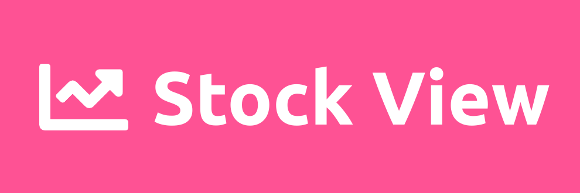

<a name="readme-top"></a>
<div align="center">
  <!-- You are encouraged to replace this logo with your own! Otherwise you can also remove it. -->
  
  <br/><br/><br/>

  <h3><b>StockView</b></h3>

</div>

<!-- TABLE OF CONTENTS -->

# 📗 Table of Contents

- [📖 About the Project](#about-project)
  - [🛠 Built With](#built-with)
    - [Tech Stack](#tech-stack)
    - [Key Features](#key-features)
  - [🚀 Live Demo](#live-demo)
  - [🚀 Presentation Demo](#presentation-demo)
- [💻 Getting Started](#getting-started)
  - [Setup](#setup)
  - [Prerequisites](#prerequisites)
  - [Install](#install)
  - [Usage](#usage)
- [👥 Authors](#authors)
- [🔭 Future Features](#future-features)
- [🤝 Contributing](#contributing)
- [⭐️ Show your support](#support)
- [🙏 Acknowledgements](#acknowledgements)
- [📝 License](#license)

<!-- PROJECT DESCRIPTION -->

# 📖 StockView <a name="about-project"></a>


**StockView** This project aims to provide a user-friendly and informative platform for exploring and analyzing financial data of publicly traded stocks. The application offers an intuitive interface that allows users to search for specific stocks and access detailed information such as income statements, cash flow statements, and balance sheets.

## 🛠 Built With <a name="built-with"></a>

### Tech Stack <a name="tech-stack"></a>


<details>
  <summary>Client</summary>
  <ul>
    <li>HTML</li>
    <li>CSS</li>
    <li>Javascript</li>
    <li>React</li>
    <li>React Redux Toolkit</li>
  </ul>
</details>

<details>
  <summary>Deployment</summary>
  <ul>
    <li>Netlify</li>
  </ul>
</details>

<details>
  <summary>Testing</summary>
  <ul>
    <li>Jest</li>
  </ul>
</details>


<!-- Features -->

### Key Features <a name="key-features"></a>


- **View Stock**
- **Search Stock**
- **View Stock details**

<p align="right">(<a href="#readme-top">back to top</a>)</p>


## 🚀 Live Demo <a name="live-demo"></a>

- [Live Demo Link](https://clinquant-biscuit-047db3.netlify.app/)

<p align="right">(<a href="#readme-top">back to top</a>)</p>


## 🚀 Presentation Video <a name="presentation-demo"></a>

- [Presentation Video](https://www.loom.com/share/973e2580fcbd443fa789344f4a24b65c?sid=41a46d29-d237-4e36-b34e-90d2113e996a)

<p align="right">(<a href="#readme-top">back to top</a>)</p>


<!-- GETTING STARTED -->

## 💻 Getting Started <a name="getting-started"></a>

To get a local copy up and running, follow these steps.

### Prerequisites

In order to run this project you need:

<!--
Example command:

```sh
 gem install rails
```
 -->
 <ul>
    <li>A working browser</li>
    <li>Node.js</li>
    <li>A code editor like Visual Studio Code</li>
  </ul>

### Setup

Clone this repository to your desired folder:


```
  git clone https://github.com/Aqurds/stock-view.git
  cd stock-view
```

### Install

```
  npm install
```

### Usage

```
  npm start
```


<!-- AUTHORS -->

## 👤 Authors <a name="authors"></a>
👤 Aqurds
- GitHub: [@Aqurds](https://github.com/Aqurds)
- Twitter: [@Aqurds](https://twitter.com/Aqurds)
- LinkedIn: [omaraqurds](https://linkedin.com/in/omaraqurds)


<p align="right">(<a href="#readme-top">back to top</a>)</p>

<!-- FUTURE FEATURES -->

## 🔭 Future Features <a name="future-features"></a>

- **Add Balance Sheet of Stock**
- **Bookmark Stock**
- **Track Stock price changes**
- **Alert on Target price**

<p align="right">(<a href="#readme-top">back to top</a>)</p>

<!-- CONTRIBUTING -->

## 🤝 Contributing <a name="contributing"></a>

Contributions, issues, and feature requests are welcome!

Feel free to check the [issues page](https://github.com/Aqurds/stock-view/issues).

<p align="right">(<a href="#readme-top">back to top</a>)</p>

<!-- SUPPORT -->

## ⭐️ Show your support <a name="support"></a>

If you like this project please send a welcome message on Twitter and let's have a chat to share coding knowledge.

<p align="right">(<a href="#readme-top">back to top</a>)</p>

<!-- ACKNOWLEDGEMENTS -->

## 🙏 Acknowledgments <a name="acknowledgements"></a>

I would like to thank my wife, who always inspires me to be a better software engineer. Also thanks to Microverse for awesome support.

Design credit (https://www.behance.net/sakwadesignstudio)

<p align="right">(<a href="#readme-top">back to top</a>)</p>

<!-- LICENSE -->

## 📝 License <a name="license"></a>

This project is [MIT](./LICENSE) licensed.

<p align="right">(<a href="#readme-top">back to top</a>)</p>